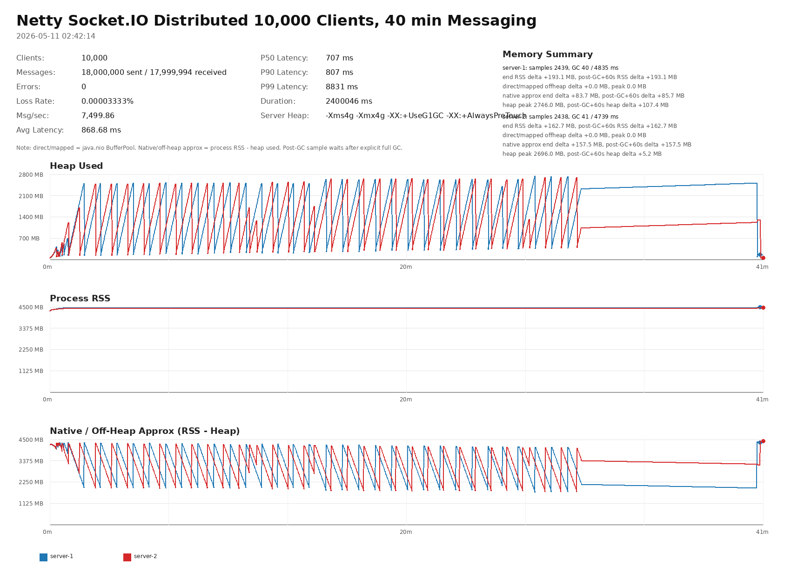
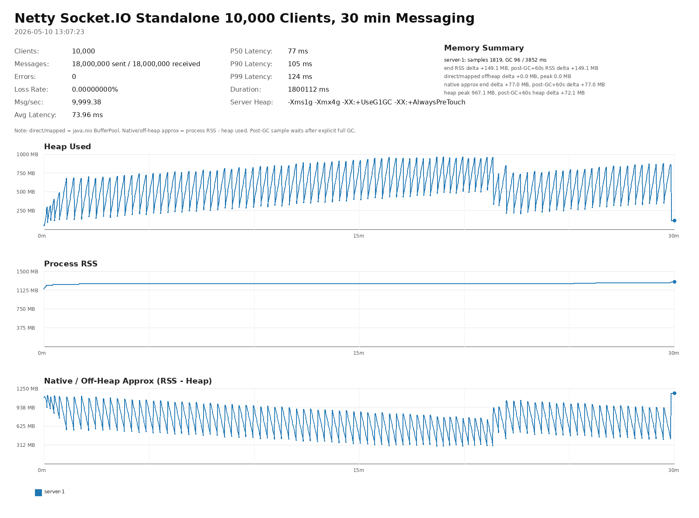

# Netty Socket.IO Performance Test Report

This report contains smoke-test results with Socket.IO servers running in separate JVM processes. Current tests sample heap, non-heap, `java.nio` direct/mapped buffer memory, process RSS, and GC statistics from the server JVMs.

## Latest Result Charts

### 2026-05-11 02:42:14 distributed

### 2026-05-10 13:07:23 standalone

### 2026-04-24 11:28:35 standalone

### 2026-04-24 11:23:14 standalone

## Historical Results

| Date | Mode | Clients | Msg/Client | Messages/sec | Avg Latency (ms) | P99 Latency (ms) | Error Rate (%) | Loss Rate (%) | Server Heap Peak MB | Server Post-GC Delta MB | Chart | Memory CSV | Version |
|------|------|---------|------------|--------------|------------------|------------------|----------------|---------------|--------------------|-------------------------|-------|------------|---------|
| 2026-05-11 02:42:14 | distributed | 10000 | 10000 | 7,499.86 | 868.68 | 8831 | 0.0000 | 0.0000 | 2746 | 107 | [png](../../smoke-test/performance-results/performance-result-distributed-25_0_2-20260511-024214-memory-chart.png) | [csv](../../smoke-test/performance-results/performance-result-distributed-25_0_2-20260511-024214-memory.csv) | 4.0.0-beta |
| 2026-05-10 13:07:23 | standalone | 10000 | 10000 | 9,999.38 | 73.96 | 124 | 0.0000 | 0.0000 | 967 | 72 | [png](../../smoke-test/performance-results/performance-result-standalone-25_0_2-20260510-130723-memory-chart.png) | [csv](../../smoke-test/performance-results/performance-result-standalone-25_0_2-20260510-130723-memory.csv) | 4.0.0-beta |
| 2026-04-24 11:28:35 | standalone | 10 | 50000 | 197,706.60 | 1443.48 | 2039 | 0.0000 | 0.0000 | 256 | 0 | [png](../../smoke-test/performance-results/performance-result-25_0_2-20260424-112835-memory-chart.png) |  | 4.0.0-alpha |
| 2026-04-24 11:23:14 | standalone | 10 | 50000 | 200,883.89 | 1409.35 | 1911 | 0.0000 | 0.0000 | 256 | 0 | [png](../../smoke-test/performance-results/performance-result-21_0_10-20260424-112314-memory-chart.png) |  | 4.0.0-alpha |
| 2026-04-24 11:19:53 | standalone | 10 | 50000 | 206,868.02 | 1394.42 | 2175 | 0.0000 | 0.0000 | 256 | 0 | [png](../../smoke-test/performance-results/performance-result-17_0_18-20260424-111953-memory-chart.png) |  | 4.0.0-alpha |
| 2026-04-24 11:18:17 | standalone | 10 | 50000 | 196,540.88 | 1448.66 | 2047 | 0.0000 | 0.0000 | 256 | 0 | [png](../../smoke-test/performance-results/performance-result-11_0_30-20260424-111817-memory-chart.png) |  | 4.0.0-alpha |
| 2025-11-11 07:46:28 | standalone | 10 | 50000 | 220,264.32 | 1308.03 | 1911 | 0.0000 | 0.0000 | 256 | 0 | [png](../../smoke-test/performance-results/performance-result-25_0_1-20251111-074628-memory-chart.png) |  | 3.0.1 |
| 2025-11-11 07:41:07 | standalone | 10 | 50000 | 198,886.24 | 1399.18 | 1975 | 0.0000 | 0.0000 | 256 | 0 | [png](../../smoke-test/performance-results/performance-result-21_0_9-20251111-074107-memory-chart.png) |  | 3.0.1 |
| 2025-11-11 07:31:13 | standalone | 10 | 50000 | 202,593.19 | 1481.27 | 2159 | 0.0000 | 0.0000 | 256 | 0 | [png](../../smoke-test/performance-results/performance-result-17_0_17-20251111-073113-memory-chart.png) |  | 3.0.1 |
| 2025-11-11 07:25:31 | standalone | 10 | 50000 | 181,028.24 | 1618.49 | 2239 | 0.0000 | 0.0000 | 256 | 0 | [png](../../smoke-test/performance-results/performance-result-11_0_29-20251111-072531-memory-chart.png) |  | 3.0.1 |
| 2025-10-16 00:48:47 | standalone | 10 | 50000 | 224,618.15 | 1142.70 | 1743 | 0.0000 | 0.0000 | 256 | 0 | [png](../../smoke-test/performance-results/performance-result-25-20251016-004847-memory-chart.png) |  | 3.0.0 |
| 2025-10-16 00:45:19 | standalone | 10 | 50000 | 206,270.63 | 1359.11 | 2007 | 0.0000 | 0.0000 | 256 | 0 | [png](../../smoke-test/performance-results/performance-result-21_0_8-20251016-004519-memory-chart.png) |  | 3.0.0 |
| 2025-10-16 00:29:15 | standalone | 10 | 50000 | 194,476.86 | 1554.77 | 2191 | 0.0000 | 0.0000 | 256 | 0 | [png](../../smoke-test/performance-results/performance-result-17_0_16-20251016-002915-memory-chart.png) |  | 3.0.0 |
| 2025-10-16 00:27:04 | standalone | 10 | 50000 | 186,567.16 | 1566.61 | 2255 | 0.0000 | 0.0000 | 256 | 0 | [png](../../smoke-test/performance-results/performance-result-11_0_28-20251016-002704-memory-chart.png) |  | 3.0.0 |
